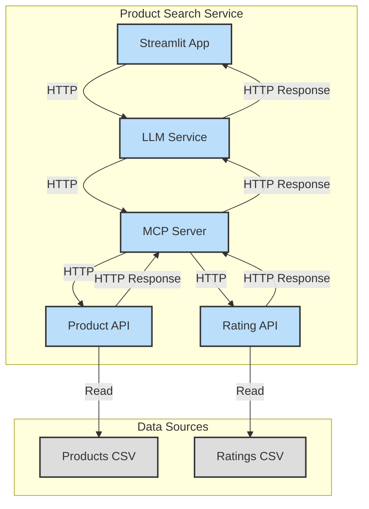
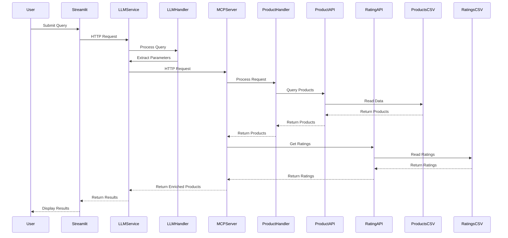

# Building Intelligent Chatbots with Existing APIs: A Practical Guide

## Introduction

In today's digital landscape, businesses often have existing APIs that serve valuable data but lack natural language interfaces. This article explores how we can leverage these existing APIs by combining them with MCP (Message Control Protocol) servers and Large Language Models (LLMs) to create intelligent chatbots that understand natural language queries and provide responses back in natural language.

**Demo on Youtube**:

## The Architecture

Our solution uses a layered architecture that bridges the gap between natural language and structured API calls

## Key Components

### 1. Natural Language Interface (Frontend)
- **Streamlit App**: Provides a user-friendly interface for natural language queries
- Handles user interactions and displays results in a conversational format
- Can be easily replaced with other frontend technologies (web, mobile, etc.)

### 2. LLM Service
- Processes natural language queries using GPT-2
- Extracts structured parameters from user input
- Acts as the "brain" of the chatbot
- Can be customized for specific domains or use cases

### 3. MCP Server (Middleware)
- Acts as a bridge between LLM and existing APIs
- Handles request transformation and routing
- Manages API versioning and compatibility
- Provides a consistent interface for the LLM to interact with

### 4. Existing API Integration
- Product API serves as an example of an existing backend service
- MCP server can be adapted to work with any RESTful API
- Maintains existing business logic and data models
- No changes required to the original API

## How It Works

1. **User Query Processing**
   - User submits a natural language query (e.g., "Show me red shoes under $100")
   - LLM Service processes the query and extracts structured parameters
   - Parameters are formatted according to the existing API's requirements

2. **API Communication**
   - MCP Server receives the structured request
   - Transforms the request to match the existing API's format
   - Forwards the request to the appropriate endpoint
   - Handles authentication and error cases

3. **Response Handling**
   - Existing API processes the request and returns data
   - MCP Server formats the response
   - LLM Service can optionally enhance the response with natural language
   - Results are displayed to the user

## Conclusion

By combining MCP servers with LLMs, we can create powerful chatbots that leverage existing APIs without requiring significant changes to the underlying systems. This approach provides a practical way to add natural language capabilities to any existing API, improving user experience while maintaining system stability.

## Next Steps

1. Explore different LLM models for specific use cases
2. Implement caching and optimization strategies
3. Add support for more complex queries and responses
4. Integrate with additional existing APIs like Order Service, Ratings and reviews and images.
