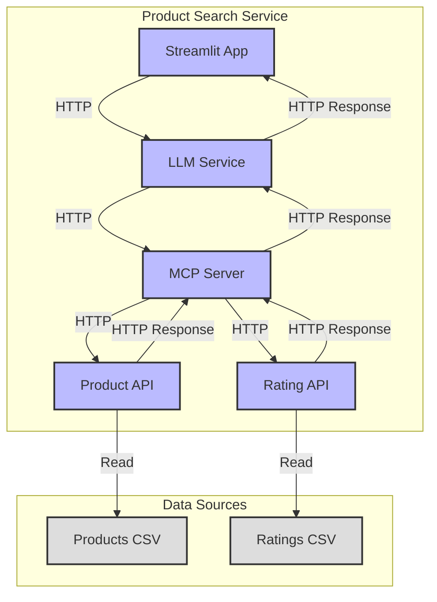

## Component Descriptions

1. **Streamlit App** (`streamlit/app.py`)
   - User interface for the product search service
   - Handles user input and displays search results
   - Communicates with LLM Service via HTTP

2. **LLM Service** (`llm-service/`)
   - Processes natural language queries
   - Uses GPT-2 for query understanding
   - Communicates with MCP Server via HTTP

3. **MCP Server** (`mcp/mcp_server.py`)
   - Middleware component that handles communication between services
   - Forwards requests to appropriate services
   - Manages API routing and error handling
   - Enriches product data with ratings from Rating API

4. **Product API** (`product-api/`)
   - Core product data service
   - Reads product data from Products CSV
   - Provides RESTful endpoints for product queries

5. **Rating API** (`rating-api/`)
   - Service providing product ratings
   - Reads ratings from Ratings CSV
   - Provides RESTful endpoints for rating queries
   - Used exclusively by MCP Server to enrich product information

6. **Data Sources**
   - **Products CSV**: Contains product information and specifications
   - **Ratings CSV**: Contains product ratings data

## Communication Flow

1. User submits a query through the Streamlit App
2. Streamlit App sends the query to LLM Service
3. LLM Service processes the query and sends structured request to MCP Server
4. MCP Server:
   - Forwards the request to Product API
   - Fetches ratings from Rating API
   - Receives ratings from Rating API
   - Enriches product data with ratings
5. Product API:
   - Reads data from Products CSV
   - Returns product information
6. Rating API:
   - Reads data from Ratings CSV
   - Returns rating information
7. Response flows back through the chain:
   - Product API → MCP Server → LLM Service → Streamlit App
8. Streamlit App displays the enriched results to the user