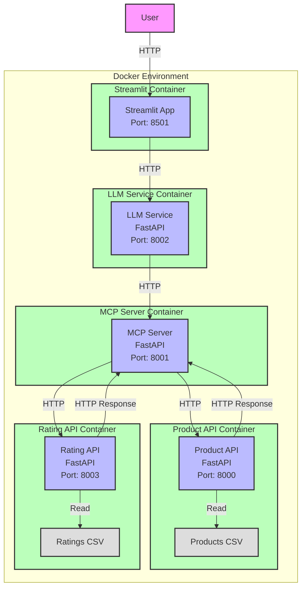

# Deployment Architecture

## Overview

This diagram shows the deployment architecture of the Product Search Service using separate Docker containers for each service. The Streamlit app is the only service accessible to users, while all other services communicate internally via HTTP. Each service runs in its own container with CSV files mounted as volumes in their respective service containers.

## Components

### 1. User Access
- Users interact only with the Streamlit app
- All other services are internal and not directly accessible

### 2. Streamlit Container
- **Streamlit App** (Port: 8501)
  - Frontend interface for user interactions
  - Containerized using Docker
  - Communicates with LLM Service
  - Only service accessible to users

### 3. LLM Service Container
- **LLM Service** (Port: 8002)
  - FastAPI-based service for natural language processing
  - Handles query processing and parameter extraction
  - Communicates with MCP Server
  - Internal service only

### 4. MCP Server Container
- **MCP Server** (Port: 8001)
  - FastAPI-based middleware service
  - Handles request transformation and routing
  - Communicates with Product API and Rating API
  - Enriches product data with ratings
  - Receives and processes rating responses
  - Internal service only

### 5. Product API Container
- **Product API** (Port: 8000)
  - FastAPI-based backend service
  - Reads product data from Products CSV
  - Provides RESTful endpoints for product queries
  - Returns product information to MCP Server
  - Internal service only
- **Products CSV**
  - Contains product information and specifications
  - Mounted as a volume in the Product API container

### 6. Rating API Container
- **Rating API** (Port: 8003)
  - FastAPI-based service for product ratings
  - Reads ratings from Ratings CSV
  - Provides rating data to MCP Server
  - Returns rating information to MCP Server
  - Internal service only
- **Ratings CSV**
  - Contains product ratings data
  - Mounted as a volume in the Rating API container

