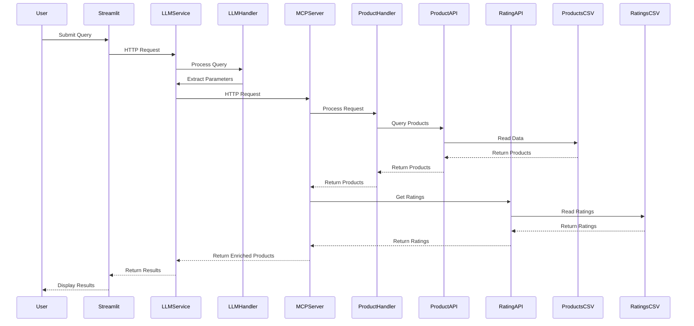

# Sequence Flow

This diagram shows the detailed sequence of interactions between components when processing a user query, including the rating enrichment process. The MCP server directly calls the Rating API to enrich product data with ratings and receives the ratings in response. Both Product API and Rating API read their data from CSV files. 